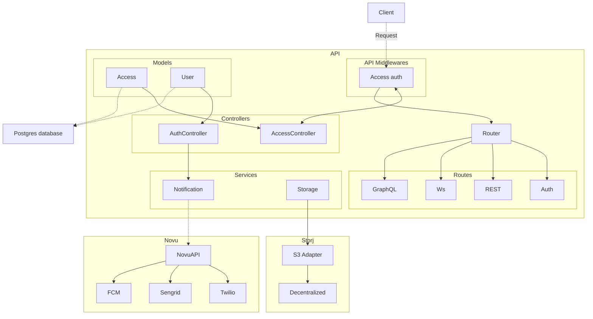

```mermaid
graph
    ExternalClient[Client] -. Request .-> AccessAuthMiddleware
    ExternalPostgres[Postgres database]
    subgraph API
        subgraph API Middlewares
                AccessAuthMiddleware[Access auth]
        end
        subgraph Models
            AccessModel[Access]
            UserModel[User]
        end
        subgraph Controllers
            AccessController
            AuthController
        end
        Router
        subgraph Routes
            AuthRoutes[Auth]
            RestRoutes[REST]
            WebsocketsRoutes[Ws]
            GraphQLRoute[GraphQL]
        end
        subgraph Services
            NotificationService[Notification]
            StorageService[Storage]
        end
    end
    subgraph Novu
        NovuAPI --> Twilio & Sengrid & FCM
    end
    subgraph Storj
        S3[S3 Adapter] --> Decentralized
    end
    AccessAuthMiddleware <--> AccessController
    AccessAuthMiddleware --> Router
    AccessModel --> AccessController
    UserModel --> AuthController
    NotificationService -.-> NovuAPI
    UserModel & AccessModel -.-> ExternalPostgres
    Router --> AuthRoutes
    Router --> RestRoutes
    Router --> WebsocketsRoutes
    Router --> GraphQLRoute
    AuthController --> NotificationService
    StorageService --> S3
```
